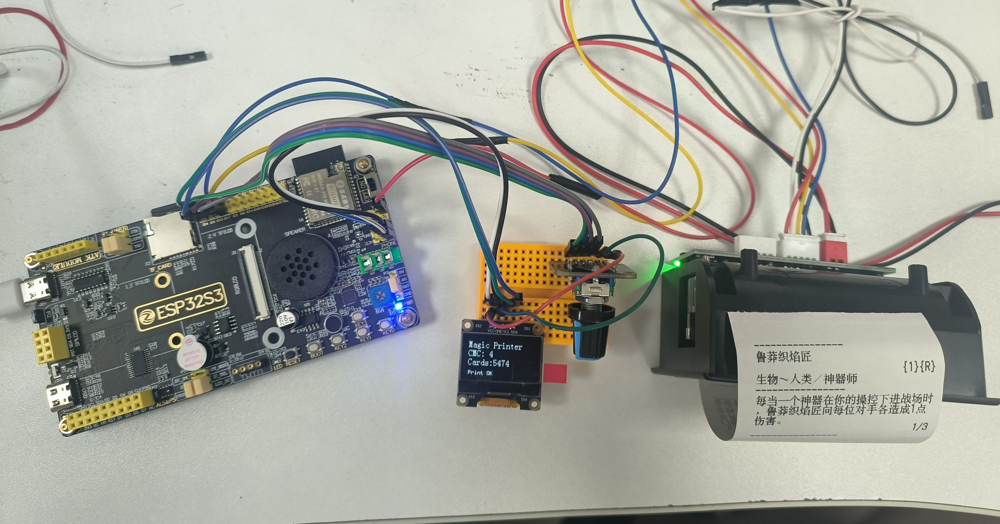

<h1 align="center">MTG Random Creature Printer for ESP32-S3</h1>

<p align="center">
A standalone ESP32-S3 device that selects a random Magic: The Gathering creature card by mana value and prints it with a TTL thermal printer for playing Momir-Vig format in paper.
</p>

<p align="center">
  <a href="README_zh-CN.md">简体中文</a> |
  <strong>English</strong>
</p>

---

## Overview

This project is an ESP32-S3-based random creature card printer for Magic: The Gathering enthusiasts.

Turn the EC11 rotary encoder to select a mana value (CMC), then press the encoder button. The ESP32-S3 reads a preprocessed card record from the SD card and sends GBK + ESC/POS data to a TTL thermal printer.

The tested prototype supports:

- CMC selection with an EC11 rotary encoder
- SSD1306 OLED status display
- SPI microSD card access
- Indexed random card lookup
- Chinese text printing through a TTL UART thermal printer

> This repository contains firmware and data-generation tools. It does not include a complete Magic card database.

## Features

- Select CMC from 1 to 15
- Display current CMC and printable-card count on OLED
- Randomly select a creature card from the chosen CMC group
- Read card data directly from an SD card
- Print preprocessed GBK + ESC/POS payloads
- Keep JSON display data and printer data in separate indexed files
- Run without a PC after the SD card has been prepared

## Hardware

| Module | Description |
|---|---|
| Main controller | ESP32-S3 development board |
| Display | 0.96-inch SSD1306 I2C OLED |
| Input | EC11 rotary encoder with push button |
| Storage | SPI TF/microSD card |
| Printer | TTL UART thermal printer with ESC/POS support |
| Printer power | Independent power supply suitable for the printer |

## Pin Assignment

| Module | Signal | ESP32-S3 GPIO |
|---|---|---:|
| OLED | SDA | GPIO4 |
| OLED | SCL | GPIO5 |
| EC11 | A | GPIO6 |
| EC11 | B | GPIO7 |
| EC11 | SW | GPIO15 |
| SD card | SCLK | GPIO12 |
| SD card | MOSI | GPIO11 |
| SD card | MISO | GPIO13 |
| SD card | CS | GPIO2 |
| Thermal printer | ESP32 TX → printer RXD | GPIO17 |
| Thermal printer | Printer TXD → ESP32 RX | GPIO18, optional |
| All modules | GND | Common ground |

### Printer wiring notes

- Use an independent power supply for the printer.
- Connect printer GND and ESP32-S3 GND together.
- For one-way printing, only `GPIO17 → printer RXD` and common ground are required.
- Do not connect a 5 V printer TX output directly to an ESP32-S3 RX pin.
- The tested UART configuration is `9600 baud, 8 data bits, no parity, 1 stop bit`.

See [`docs/wiring.md`](docs/wiring.md) for details.

## Repository Layout

```text
mtg-random-creature-printer-esp32s3/
├── firmware/
│   └── esp32s3_magic_printer/
│       ├── CMakeLists.txt
│       ├── sdkconfig.defaults
│       └── main/
│           ├── CMakeLists.txt
│           ├── main.c
│           ├── encoder.c
│           ├── encoder.h
│           ├── ssd1306.c
│           ├── ssd1306.h
│           ├── bsp_oled_codetab.h
│           ├── sd_card_reader.c
│           ├── sd_card_reader.h
│           ├── card_db.c
│           ├── card_db.h
│           ├── thermal_printer.c
│           └── thermal_printer.h
├── tools/
│   └── card_data_builder/
│       ├── README.md
│       └── card_data_builder.py
├── docs/
│   ├── wiring.md
│   ├── sd_card_format.md
│   ├── build_and_flash.md
│   └── images/
├── .gitignore
├── LICENSE
├── NOTICE.md
├── README.md
└── README_zh-CN.md
```

## SD Card Layout

Place the generated files in the SD card root directory:

```text
SD card root
├── cards.dat
├── cards_printer.bin
├── index/
│   ├── cmc_1.idx
│   ├── cmc_2.idx
│   └── ...
└── index_printer/
    ├── cmc_1.idx
    ├── cmc_2.idx
    └── ...
```

| File | Purpose |
|---|---|
| `cards.dat` | UTF-8 JSON Lines data for ESP32 parsing and future OLED previews |
| `cards_printer.bin` | GBK + ESC/POS records sent directly to the printer |
| `index/cmc_x.idx` | Offsets into `cards.dat` for a given CMC |
| `index_printer/cmc_x.idx` | Offsets into `cards_printer.bin` for a given CMC |

Each index entry is an 8-byte little-endian offset.

Printer records use this format:

```text
[4-byte little-endian payload length][GBK + ESC/POS payload]
```

See [`docs/sd_card_format.md`](docs/sd_card_format.md) for details.

## Software Requirements

- ESP-IDF v6.0.1
- ESP32-S3 target
- Git
- Python 3 for the card data builder

## Build and Flash

Open an ESP-IDF terminal:

```powershell
cd firmware/esp32s3_magic_printer
idf.py set-target esp32s3
idf.py build
idf.py -p COM3 flash monitor
```

Replace `COM3` with the serial port used by your board.

For a clean rebuild:

```powershell
Remove-Item -Recurse -Force .\build -ErrorAction SilentlyContinue
idf.py set-target esp32s3
idf.py build
```

See [`docs/build_and_flash.md`](docs/build_and_flash.md) for details.

## Preparing Card Data

This repository does not distribute the complete generated card database.

Use:

```text
tools/card_data_builder/card_data_builder.py
```

to generate:

- `cards.dat`
- `cards_printer.bin`
- `index/cmc_x.idx`
- `index_printer/cmc_x.idx`

Then copy the generated files to the SD card using the directory layout shown above.

See [`tools/card_data_builder/README.md`](tools/card_data_builder/README.md) for usage ＆ details.

## How It Works

```text
Rotate EC11
    ↓
Select CMC
    ↓
OLED displays CMC and printable-card count
    ↓
Press EC11
    ↓
Read a random offset from index_printer/cmc_x.idx
    ↓
Seek to the record in cards_printer.bin
    ↓
Read the length-prefixed GBK + ESC/POS payload
    ↓
Send the payload through UART
    ↓
Thermal printer prints the card
```

## Images




## Troubleshooting

### The printer does not print

- Confirm `GPIO17` is connected to printer `RXD`.
- Confirm the ESP32-S3 and printer share a common ground.
- Confirm the configured baud rate.
- Confirm the printer power supply is sufficient.
- Test the printer with the standalone UART test first.

### The SD card does not mount

- Confirm the card is inserted correctly.
- Use FAT32 for initial testing.
- Confirm the SPI and CS pins.
- Confirm the generated files are in the SD card root directory.

### OLED works but the card count is zero

- Check that the corresponding `cmc_x.idx` exists.
- Check that the index size is a multiple of 8.
- Check that `index_printer/` was copied to the SD card.

## Roadmap

- Parse `cards.dat` and display the card name on OLED
- Read JSON and printer payload using the same random index
- Add printer Busy or DTR flow control
- Add configurable printer baud rate
- Add enclosure and PCB design files
- Support additional OLED and printer models

## License

Original source code and documentation in this repository are released under the license in [`LICENSE`](LICENSE).

Third-party libraries, card data, trademarks, names, rules text, symbols, and other intellectual property remain subject to their respective owners and licenses.

## Disclaimer

This is an unofficial, non-commercial fan-made project.

Magic: The Gathering and related names, card text, symbols, and intellectual property are owned by Wizards of the Coast. This project is not affiliated with, endorsed by, sponsored by, or specifically approved by Wizards of the Coast.

Users are responsible for obtaining and processing card data from lawful sources and complying with applicable terms of use.
